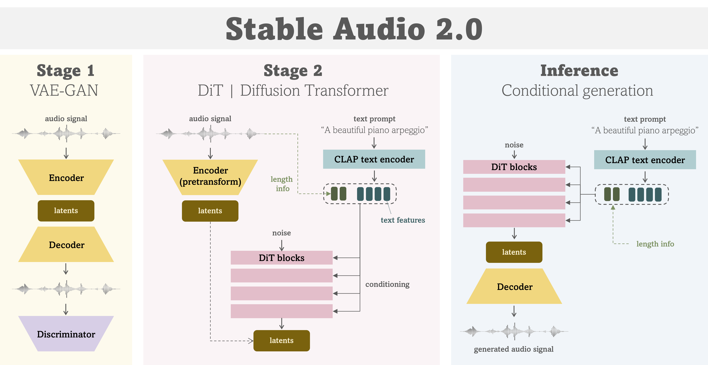

# 🐈 friendly-stable-audio-tools



This repository is a refactored / updated version of `stable-audio-tools` 
which is an open-source code for **audio/music generative models**
originally by Stability AI.

- https://github.com/Stability-AI/stable-audio-tools

This repository contains the following additional features:
- 🔥 Refactored codes of `stable-audio-tools` for improved readability and usability.
- 🔥 Useful scripts for evaluating and playing with your own trained models.
- 🔥 Instruction on how to train models such as `Stable Audio 2.0`.
- 🔥 Detailed documentation and convenient scripts for playing with `Stable Audio Open 1.0`.

# 🔥 Stable Audio Open

Stability AI has now open-sourced the pre-trained model for Stable Audio.

- Official release : [Introducing Stable Audio Open](https://stability.ai/news/introducing-stable-audio-open)

For detailed instructions on how to use Stable Audio Open, please refer to this document if you are interested.

- 🔥 [**Documentation for Stable Audio Open 1.0**](./docs/Stable_Audio_Open.md)
- 🔥 You can now perform multi-GPU/node generation using prompt inputs provided via a YAML file. 
Please see an example here -> [generate_conditions.yaml](./example/generation/generate_conditions.yaml).

# Requirements

- PyTorch 2.0 or later for Flash Attention support
- Development for the repo is done in Python 3.8.10 or later

# Install

To run the training scripts or inference code, you'll need to clone this repository, navigate to the root directory, and then execute the `pip` command as follow:
```bash
$ git clone https://github.com/yukara-ikemiya/friendly-stable-audio-tools.git
$ cd friendly-stable-audio-tools
$ pip install .
$ # you may need to execute this to avoid Accelerate import error
$ pip uninstall -y transformer-engine
```

# Building a training environment

To simplify setting up the training environment, I recommend to use container systems like `Docker` or `Singularity` instead of installing dependencies on each GPU machine. Below are the steps for creating Docker and Singularity containers. 

All example scripts are stored at the [container](container/) folder.

Please be sure that Docker and Singularity are installed in advance.

### 1. Create a Docker image

```bash
$ # create a Docker image
$ NAME=friendly-stable-audio-tools
$ docker build  -t ${NAME} -f ./container/${NAME}.Dockerfile .
```

### 2. Convert a Docker image to a Singularity container

```bash
$ # convert a Docker image to a Singularity container
$ singularity build friendly-stable-audio-tools.sif docker-daemon://friendly-stable-audio-tools
```

By running the above script, `friendly-stable-audio-tools.sif` should be created in the working directory.

# Interface

A basic Gradio interface is provided to test out trained models. 

For example, to create an interface for the [`stable-audio-open-1.0`](https://huggingface.co/stabilityai/stable-audio-open-1.0) model, once you've accepted the terms for the model on Hugging Face, you can run:
```bash
$ python3 ./run_gradio.py --pretrained-name stabilityai/stable-audio-open-1.0
```

If you need more detailed instruction on `Stable Audio Open`, I recommend referring to the [Gradio interface](./docs/Stable_Audio_Open.md#2-gradio-interface) part of the `Stable Audio Open` documentation.

The `run_gradio.py` script accepts the following command line arguments:

- `--pretrained-name` PRETRAINED_NAME (optional)
  - The model name on Hugging Face Hug (e.g. `stabilityai/stable-audio-open-1.0`)
  - Will prioritize `model.safetensors` over `model.ckpt` in the repo
  - When this is specified, `model-config` and `ckpt-path` are ignored.
- `--model-config` MODEL_CONFIG  (optional)
  - Path to the model config file for a local model
- `--ckpt-path` CKPT_PATH  (optional)
  - Path to unwrapped model checkpoint file for a local model
- `--pretransform-ckpt-path` PRETRANSFORM_CKPT_PATH (optional)
  - Path to an unwrapped pretransform checkpoint. This replaces the pretransform in the model.
- `--username` USERNAME / `--password` PASSWORD  (optional)
  - Used together to set a login for the Gradio demo
- `--model-half`  (optional)
  - Whether to use half precision
- `--tmp-dir` TMP_DIR  (optional)
  - Temporary directory for saving output files

# Logging

## WandB setting


The training code also requires a Weights & Biases account to log the training outputs and demos. Create an account and log in with:
```bash
$ wandb login
```
Or you can also pass an API key as an environment variable `WANDB_API_KEY`.
(You can obtain the API key from https://wandb.ai/authorize after logging in to your account.)
```bash
$ WANDB_API_KEY="12345x6789y..."
```

This method is convenient when you want to execute the code using containers such as Docker or Singularity.


# Training

## Configuration files

Before starting your training run, you have to prepare the following two configuration files.

- model config file
- dataset config file

For more information about those, refer to the [Configuration](#configurations) section below.

## Training from scratch

To start a training run, run the `train.py` script in the repo root with:
```bash
$ python3 train.py --dataset-config /path/to/dataset/config --model-config /path/to/model/config --name my_experiment
```

The `--name` parameter will set the project name for your Weights and Biases run.

## Fine-tuning

Fine-tuning involves resuming a training run from a pre-trained checkpoint. 

- To resume training from a wrapped checkpoint, you can pass in the checkpoint path (.ckpt) to `train.py` with the `--ckpt-path` flag.
- To start fresh training from a pre-trained unwrapped model, you can pass in the unwrapped checkpoint path (.ckpt) to `train.py` with the `--pretrained-ckpt-path` flag.

## Unwrapping a model

`stable-audio-tools` uses PyTorch Lightning to facilitate multi-GPU and multi-node training. 

When a model is being trained, it is wrapped in a "training wrapper", which is a `pl.LightningModule` that contains all of the relevant objects needed only for training. That includes things like discriminators for autoencoders, EMA copies of models, and all of the optimizer states.

The checkpoint files created during training include this training wrapper, which greatly increases the size of the checkpoint file.

`unwrap_model.py` takes in a wrapped model checkpoint and save a new checkpoint file including only the model itself.

That can be run with from the repo root with:
```bash
$ python3 unwrap_model.py --model-config /path/to/model/config --ckpt-path /path/to/wrapped/ckpt.ckpt --name /new/path/to/new_ckpt_name
```

Unwrapped model checkpoints are required for:
  - Inference scripts
  - Using a model as a pretransform for another model (e.g. using an autoencoder model for latent diffusion)
  - Fine-tuning a pre-trained model with a modified configuration (i.e. partial initialization)


# Configurations
Training and inference code for `stable-audio-tools` is based around JSON configuration files that define model hyperparameters, training settings, and information about your training dataset.

## Model config
The model config file defines all of the information needed to load a model for training or inference. It also contains the training configuration needed to fine-tune a model or train from scratch.

The following properties are defined in the top level of the model configuration:

- `model_type`
  - The type of model being defined, currently limited to one of `"autoencoder", "diffusion_uncond", "diffusion_cond", "diffusion_cond_inpaint", "diffusion_autoencoder", "lm"`.
- `sample_size`
  - The length of the audio provided to the model during training, in samples. For diffusion models, this is also the raw audio sample length used for inference.
- `sample_rate`
  - The sample rate of the audio provided to the model during training, and generated during inference, in Hz.
- `audio_channels`
  - The number of channels of audio provided to the model during training, and generated during inference. Defaults to 2. Set to 1 for mono.
- `model`
  - The specific configuration for the model being defined, varies based on `model_type`
- `training`
  - The training configuration for the model, varies based on `model_type`. Provides parameters for training as well as demos.

## Dataset config
`stable-audio-tools` currently supports two kinds of data sources: local directories of audio files, and WebDataset datasets stored in Amazon S3. More information can be found in [the dataset config documentation](docs/datasets.md)

## Additional training flags

Additional optional flags for `train.py` include:
- `--config-file`
  - The path to the defaults.ini file in the repo root, required if running `train.py` from a directory other than the repo root
- `--pretransform-ckpt-path`
  - Used in various model types such as latent diffusion models to load a pre-trained autoencoder. Requires an unwrapped model checkpoint.
- `--save-dir`
  - The directory in which to save the model checkpoints
- `--checkpoint-every`
  - The number of steps between saved checkpoints.
  - *Default*: 10000
- `--batch-size`
  - Number of samples per-GPU during training. Should be set as large as your GPU VRAM will allow.
  - *Default*: 8
- `--num-gpus`
  - Number of GPUs per-node to use for training
  - *Default*: 1
- `--num-nodes`
  - Number of GPU nodes being used for training
  - *Default*: 1
- `--accum-batches`
  - Enables and sets the number of batches for gradient batch accumulation. Useful for increasing effective batch size when training on smaller GPUs.
- `--strategy`
  - Multi-GPU strategy for distributed training. Setting to `deepspeed` will enable DeepSpeed ZeRO Stage 2.
  - *Default*: `ddp` if `--num_gpus` > 1, else None
- `--precision`
  - floating-point precision to use during training
  - *Default*: 16
- `--num-workers`
  - Number of CPU workers used by the data loader
- `--seed`
  - RNG seed for PyTorch, helps with deterministic training

# 🔥 Let's train `Stable Audio 2.0`

## Prerequisites

### Prepare a checkpoint of CLAP encoder

To use CLAP encoder for conditioning music generation, you have to prepare a pretrained checkpoint file of CLAP.

1. Download a pretrained CLAP checkpoint trained with music dataset (`music_audioset_epoch_15_esc_90.14.pt`)
from the [LAION CLAP repository](https://github.com/LAION-AI/CLAP?tab=readme-ov-file#pretrained-models).
2. Store the checkpoint file to a directory of your choice.
3. Edit a `model config` file of Stable Audio 2.0 as follows

= stable_audio_2_0.json =
```json
...
"model": {
  ...
  "conditioning": {
            "configs": [
                {
                    ...
                    "config": {
                        ...
                        "clap_ckpt_path": "ckpt/clap/music_audioset_epoch_15_esc_90.14.pt",
                    ...
```

### Prepare audio and metadata for training

Since ***Stable Audio*** uses text prompts as condition for music generation, you have to prepare them as metadata in addition to audio data.

When using a dataset in a local environment, I support the use of metadata in JSON format as follows.

1. You can include any information as metadata in a JSON file, but you must always include the text data named `prompt` required for training of Stable Audio.

= music_2.json =
```
{
    "prompt": "This is an electronic song sending positive vibes."
}
```

2. The metadata files must be placed in the same directory as corresponding audio files. And the file names must also be the same.

```
.
└── dataset/
    ├── music_1.wav
    ├── music_1.json
    ├── music_2.wav
    ├── music_2.json
    └── ...
```

## Stage 1 : VAE-GAN (compression model)

### Training

As the 1st stage of Stable Audio 2.0, you'll train a VAE-GAN which is a compression model for audio signal.

The model config file for a VAE-GAN is place in the [configs](stable_audio_tools/configs/model_configs/autoencoders/) directory. Regarding dataset configuration, please prepare a dataset config file corresponding to your own datasets.

Once you prepare configuration files, you can execute a training job like this:
```bash
CONTAINER_PATH="/path/to/sif/friendly-stable-audio-tools.sif"
ROOT_DIR="/path/to/friendly-stable-audio-tools/"
DATASET_DIR="/path/to/your/dataset/"
OUTPUT_DIR="/path/to/output/directory/"

MODEL_CONFIG="stable_audio_tools/configs/model_configs/autoencoders/stable_audio_2_0_vae.json"
DATASET_CONFIG="stable_audio_tools/configs/dataset_configs/local_training_example.json"

BATCH_SIZE=10 # WARNING : This is batch size per GPU
WANDB_API_KEY="12345x6789y..."
PORT=12345

# Singularity container case
# NOTE: Please change each configuration as you like

singularity exec --nv --pwd $ROOT_DIR -B $ROOT_DIR -B $DATASET_DIR \
  --env WANDB_API_KEY=$WANDB_API_KEY \
  ${CONTAINER_PATH} \
  torchrun --nproc_per_node gpu --master_port ${PORT} \
  ${ROOT_DIR}/train.py \
    --dataset-config ${DATASET_CONFIG} \
    --model-config ${MODEL_CONFIG} \
    --name "vae_training" \
    --num-gpus 8 \
    --batch-size ${BATCH_SIZE} \
    --num-workers 8 \
    --save-dir ${OUTPUT_DIR}
```

### Model unwrapping

As described in the [unwrapping-a-model](#unwrapping-a-model) section, 
after completing the training of VAE,
you need to unwrap the model checkpoint for using the next stage training.

```bash
CKPT_PATH="/path/to/wrapped_ckpt/last.ckpt"
# NOTE: file extension ".ckpt" will be automatically added to the end of OUTPOUT_DIR name
OUTPUT_PATH="/path/to/output_name/unwrapped_last"

singularity exec --nv --pwd $ROOT_DIR -B $ROOT_DIR \
  --env WANDB_API_KEY=$WANDB_API_KEY \
  ${CONTAINER_PATH} \
  torchrun --nproc_per_node gpu --master_port ${PORT} \
    ${ROOT_DIR}/unwrap_model.py \
    --model-config ${MODEL_CONFIG} \
    --ckpt-path ${CKPT_PATH} \
    --name ${OUTPUT_PATH}
```

### Reconstruction test

Once you finished the VAE training, you might want to test and evaluate reconstruction quality of the trained model.

I support reconstruction of audio files in a directory with `reconstruct_audios.py`,
and you can use the reconstructed audios for your evaluation.

```bash
AUDIO_DIR="/path/to/original_audio/"
OUTPUT_DIR="/path/to/output_audio/"

FRAME_DURATION=1.0 # [sec]
OVERLAP_RATE=0.01
BATCH_SIZE=50

singularity exec --nv --pwd $ROOT_DIR -B $ROOT_DIR -B $DATASET_DIR \
  --env WANDB_API_KEY=$WANDB_API_KEY \
  ${CONTAINER_PATH} \
  torchrun --nproc_per_node gpu --master_port ${PORT} \
    ${ROOT_DIR}/reconstruct_audios.py \
    --model-config ${MODEL_CONFIG} \
    --ckpt-path ${UNWRAP_CKPT_PATH} \
    --audio-dir ${AUDIO_DIR} \
    --output-dir ${OUTPUT_DIR} \
    --frame-duration ${FRAME_DURATION} \
    --overlap-rate ${OVERLAP_RATE} \
    --batch-size ${BATCH_SIZE}
```

## Stage 2 : Diffusion Transformer (DiT)

### Training

As the 2nd stage of Stable Audio 2.0, you'll train a DiT which is a generative model in latent domain.

Before this part, please make sure that 
- you have met all of the [prerequisites](#prerequisites)
- you have trained the VAE model and created an unwrapped checkpoints file (See the [VAE](#stage-1--vae-compression-model) section.)

Now, you can train a DiT model as follows:
```bash
CONTAINER_PATH="/path/to/sif/friendly-stable-audio-tools.sif"
ROOT_DIR="/path/to/friendly-stable-audio-tools/"
DATASET_DIR="/path/to/your/dataset/"
OUTPUT_DIR="/path/to/output/directory/"

MODEL_CONFIG="stable_audio_tools/configs/model_configs/txt2audio/stable_audio_2_0.json"
DATASET_CONFIG="stable_audio_tools/configs/dataset_configs/local_training_example.json"

# Pretrained checkpoint of VAE (Stage-1) model
PRETRANSFORM_CKPT="/path/to/vae_ckpt/unwrapped_last.ckpt"

BATCH_SIZE=10 # WARNING : This is batch size per GPU
WANDB_API_KEY="12345x6789y..."
PORT=12345

singularity exec --nv --pwd $ROOT_DIR -B $ROOT_DIR -B $DATASET_DIR \
  --env WANDB_API_KEY=$WANDB_API_KEY \
  ${CONTAINER_PATH} \
  torchrun --nproc_per_node gpu --master_port ${PORT} \
    ${ROOT_DIR}/train.py \
    --dataset-config ${DATASET_CONFIG} \
    --model-config ${MODEL_CONFIG} \
    --pretransform-ckpt-path ${PRETRANSFORM_CKPT} \
    --name "dit_training" \
    --num-gpus ${NUM_GPUS} \
    --batch-size ${BATCH_SIZE} \
    --save-dir ${OUTPUT_DIR}
```

# Todo
- [ ] Add convenient scripts for sampling
- [ ] Add more audio augumentations
- [ ] Add documentation for Gradio interface
- [ ] Add troubleshooting section
- [ ] Add contribution guidelines