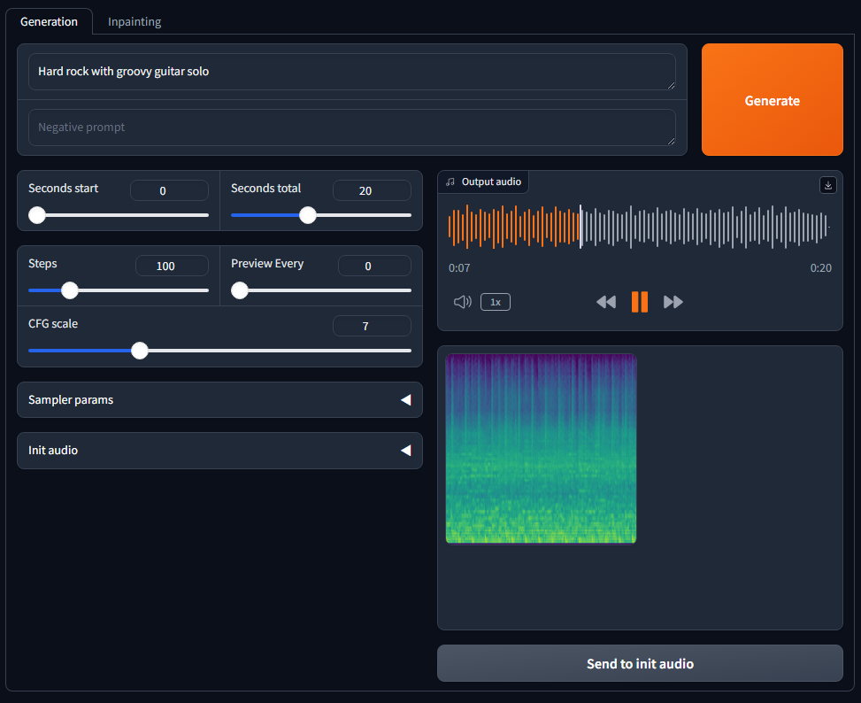

# 🐱 **Stable Audio Open 1.0**


Stability AI has finally released the pretrained model weights for `Stable Audio`.

- Official release : [Introducing Stable Audio Open](https://stability.ai/news/introducing-stable-audio-open)

To help you smoothly experiment / play with this model,
I have compiled detailed instructions for running `Stable Audio Open 1.0`,
along with some information about the model below.


# Prerequisites

## Build an environment

To install dependencies and build an environment for this (friendly-stable-audio-tools) repository, please follow the instruction in [README](../README.md).

## Authentication of HuggingFace

Since using `Stable Audio Open 1.0` requires authentication with a HuggingFace account,
you have to sign-up/log-in to HuggingFace account and accept the conditions to access the weights.

- https://huggingface.co/stabilityai/stable-audio-open-1.0

### Login setting

If you want to access the weights from your local environment, you need to let huggingface-hub know who-you-are.

There are several ways to do that, and you can follow the official instruction here.

- https://huggingface.co/docs/huggingface_hub/quick-start#authentication

In my case, the use of an environment variable `HF_TOKEN` was convenient.

1. Create a HuggingFace token for accessing the weights from https://huggingface.co/settings/tokens.
2. Set the token to `HF_TOKEN` variable when running your script.


# Model details

I extracted the model configuration of `Stable Audio Open 1.0` as with other models in the configuration directory.

- [stable_audio_open_1_0.json](../stable_audio_tools/configs/model_configs/txt2audio/stable_audio_open_1_0.json)

You can see that the main model architecture is exactly the same as **`Stable Audio 2.0`**. However, an interesting difference is that the pretrained encoder used to extract features from text prompts has changed from the CLAP text encoder to **T5 encoder** 🙄🙄.
- Stable Audio 2.0 : CLAP text encoder
- Stable Audio Open 1.0 : T5 encoder

# 🔥 Let's play

This repository provides two methods to test out `Stable Audio Open`.

1. Multi-GPU generation with YAML input
2. Gradio interface

## 1. Multi-GPU/node generation with YAML input

Instead of generating samples one by one, 
you might want to use GPU power to generate multiple samples in parallel.
To achieve this, I provide the script [`generate.py`](../generate.py),
which allows you to input sets of text prompts and other parameters via a YAML file.

### Prepare YAML condition file

You can specify condition sets, sample names and sub-directories for audio file output as follows.
- YAML example : [generate_conditions.yaml](../example/generation/generate_conditions.yaml)

= generate_conditions.json =
```yaml
music:
  drum:
    sample-1:
      prompt: 128 BPM tech house drum loop
      seconds_start: 0
      seconds_total: 30
    sample-2:
      prompt: 140 BPM heavy metal drum solo
      seconds_start: 0
      seconds_total: 20
sfx:
  sample-1:
    prompt: Thunder claps, and hard rain falls and splashes on surfaces
    seconds_start: 0
    seconds_total: 10
  sample-2:
    prompt: Birds chirping and water dripping with some banging in the background
    seconds_start: 0
    seconds_total: 10
```

With the above yaml input, the script outputs generated audio files with the following directory structure.

= output directory =
```
.
├── music/
│   └── drum/
│       ├── sample-1_item-1.wav
│       └── sample-2_item-1.wav
└── sfx/
    ├── sample-1_item-1.wav
    └── sample-2_item-1.wav
```

### Execute the script

The script [`generate.py`](../generate.py) supports some arguments for controlling generation process.

- Main script : [`generate.py`](../generate.py)

If you want to know the details of the arguments, please execute `generate.py` with `-h` option,
or read the actual codes in the scripts.

As same as training or other scripts, you can execute the script with Singularity container as follows.

```bash
CONTAINER_PATH="/path/to/sif/friendly-stable-audio-tools.sif"
ROOT_DIR="/path/to/friendly-stable-audio-tools/"
OUTPUT_DIR="/path/to/output_dir/"

COND_YAML_PATH="example/generation/generate_conditions.yaml"
N_SAMPLE_PER_COND=2
BATCH_SIZE=20

HF_TOKEN="hf_abcdefgh123ijk..." # set your token

singularity exec --nv --pwd $ROOT_DIR -B $ROOT_DIR \
    --env HF_TOKEN=$HF_TOKEN \
    ${CONTAINER_PATH} \
    torchrun --nproc_per_node gpu --master_port 11111 \
        ${ROOT_DIR}/generate.py \
        --output-dir ${OUTPUT_DIR} \
        --cond-yaml-path ${COND_YAML_PATH} \
        --n-sample-per-cond ${N_SAMPLE_PER_COND} \
        --batch-size ${BATCH_SIZE} \
        --clip-length
```

## 2. Gradio interface

This repository also supports a Gradio interface for trying out the generation with a simple GUI.



You can run the Gradio script using Singularity container as follows.

```bash
CONTAINER_PATH="/path/to/sif/friendly-stable-audio-tools.sif"
ROOT_DIR="/path/to/friendly-stable-audio-tools/"
TMP_DIR="/path/to/temporary_dir/" # e.g. 'tmp/'

HF_TOKEN="hf_abcdefgh123ijk..." # set your token

singularity exec --nv --pwd $ROOT_DIR -B $ROOT_DIR \
  --env HF_TOKEN=$HF_TOKEN \
  ${CONTAINER_PATH} \
  torchrun --nproc_per_node gpu --master_port ${PORT} \
    ${ROOT_DIR}/run_gradio.py \
    --pretrained-name stabilityai/stable-audio-open-1.0 \
    --tmp-dir ${TMP_DIR}
```