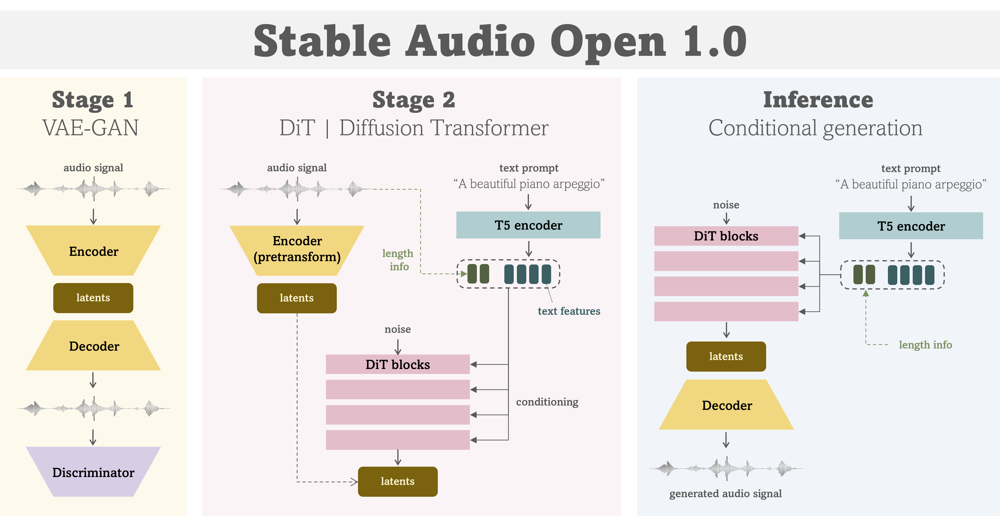

# 🐱 **Stable Audio Open 1.0**

Stability AI has finally released the pretrained model weights for `Stable Audio`.

- Official release : [Introducing Stable Audio Open](https://stability.ai/news/introducing-stable-audio-open)

To help you smoothly experiment / play with this model,
I have compiled detailed instructions for running `Stable Audio Open 1.0`,
along with some information about the model below.

# Prerequisites

## Build an environment

To install dependencies and build an environment for this (friendly-stable-audio-tools) repository, please follow the instruction in [README](../README.md).

## Authentication of HuggingFace

Since using `Stable Audio Open 1.0` requires authentication with a HuggingFace account,
you have to sign-up/log-in to HuggingFace account and accept the conditions to access the weights.

- https://huggingface.co/stabilityai/stable-audio-open-1.0

### Login setting

If you want to access the weights from your local environment, you need to let huggingface-hub know who-you-are.

There are several ways to do that, and you can follow the official instruction here.

- https://huggingface.co/docs/huggingface_hub/quick-start#authentication

In my case, the use of an environment variable `HF_TOKEN` was convenient.

1. Create a HuggingFace token for accessing the weights from https://huggingface.co/settings/tokens.
2. Set the token to `HF_TOKEN` variable when running your script.

# Model details

I extracted the model configuration of `Stable Audio Open 1.0` as with other models in the configuration directory.

- [stable_audio_open_1_0.json](../stable_audio_tools/configs/model_configs/txt2audio/stable_audio_open_1_0.json)

You can see that the main model architecture is exactly the same as **`Stable Audio 2.0`**. However, an interesting difference is that the pretrained encoder used to extract features from text prompts has changed from the CLAP text encoder to **T5 encoder** 🙄🙄.
- Stable Audio 2.0 : CLAP text encoder
- Stable Audio Open 1.0 : T5 encoder

# 🔥 Let's play